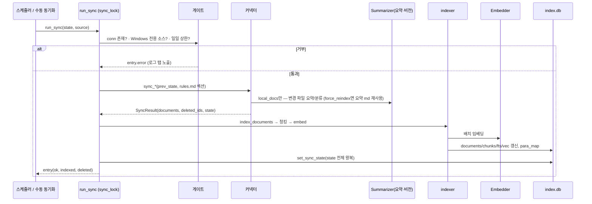
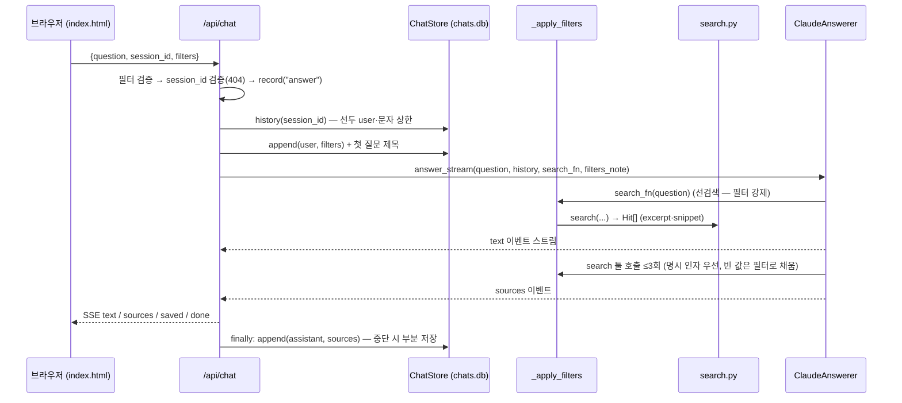
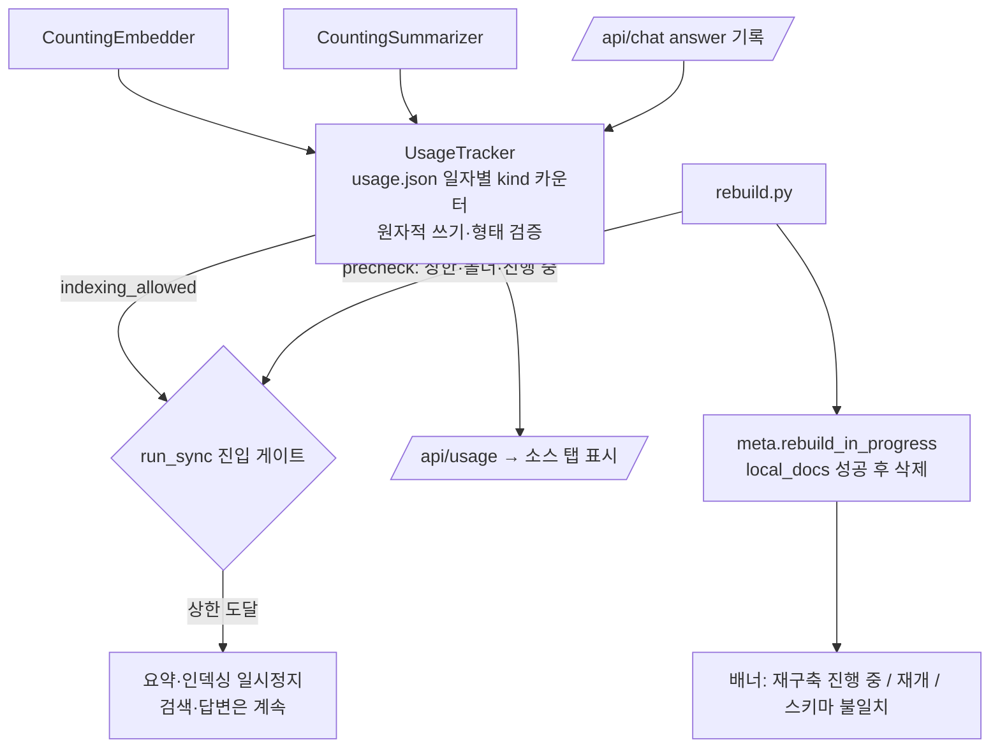

# llmsearch 아키텍처 다이어그램 (2026-08-30, master cb58811 기준)

코드에서 직접 도출한 구조도. 모듈명은 `src/llmsearch/` 기준.

## 1. 시스템 구성 (컴포넌트)

```mermaid
flowchart LR
  subgraph Sources[외부 소스]
    FS[(로컬 문서 폴더<br/>watch_folders)]
    NT[(개인 노트<br/>notes_folders + rules.md + exports/)]
    OL[Outlook COM<br/>메일·일정 — Windows 전용]
    CF[Confluence 서버]
    JR[Jira 서버]
  end

  subgraph Connectors[connectors/]
    LD[local_docs<br/>markitdown → 요약·PARA 분류 → summaries/]
    NO[notes]
    OM[outlook_mail]
    OC[outlook_cal]
    CO[confluence 미러]
    JI[jira 이슈+댓글]
  end

  subgraph LLM[외부 API — usage.py 카운팅 래퍼 경유]
    GS[Gemini 요약·비전<br/>summarize.py]
    GE[Gemini 임베딩 768 MRL<br/>embeddings.py]
    CL[Claude 답변 + search 툴<br/>llm.py]
  end

  subgraph Core[인덱스·검색]
    IDX[indexer.py<br/>청킹 → FTS5 + vec]
    DB[(index.db<br/>documents·chunks·chunks_fts·chunk_vecs<br/>sync_state·para_map·meta)]
    SR[search.py<br/>벡터30 + FTS30 → RRF → 문서 승격·발췌]
    RB[rebuild.py<br/>제자리 초기화·요약 md 재사용·마커 재개]
  end

  subgraph Web[web/app.py — FastAPI 127.0.0.1]
    RS[run_sync<br/>소스별 격리·상한 게이트·스케줄러]
    CH[/api/chat<br/>필터·세션 이력·SSE]
    OPS[/api/rules · resummarize · rebuild<br/>eval/golden · usage · status/]
    UI[static/index.html<br/>채팅·소스·로그·설정 탭]
  end

  subgraph Stores[data_dir 사용자 산출물]
    SUM[(summaries/ PARA md)]
    CHS[(chats.db 세션·메시지)]
    USG[(usage.json 일자별 카운터)]
    RUL[(rules.md 용어집·분류·요약·답변 규칙)]
    GLD[(golden.yaml 평가 세트)]
    EXP[(exports/ 대화 md)]
  end

  FS --> LD --> GS
  LD --> SUM
  NT --> NO
  OL -->|ComWorker STA 스레드| OM & OC
  CF --> CO
  JR --> JI
  LD & NO & OM & OC & CO & JI --> RS --> IDX --> GE
  IDX --> DB
  RS --> USG
  UI --> CH --> SR --> DB
  SR --> GE
  CH --> CL --> SR
  CH --> CHS
  CHS --> EXP --> NT
  UI --> OPS
  OPS --> RB --> DB
  OPS --> RUL & GLD & USG
  RUL --> GS & CL
```

## 2. 동기화 파이프라인 (run_sync 1회)



## 3. 채팅·답변 파이프라인 (/api/chat)



## 4. 비용 통제·운영 흐름



## 5. 실행 환경

```mermaid
flowchart LR
  subgraph WIN[Windows — 실사용]
    W1[python -m llmsearch --config config.yaml]
    W2[Outlook·PowerPoint COM ✓<br/>파일 열기 ✓<br/>sqlite-vec 휠 ✓]
  end
  subgraph WSL[WSL2 — 개발·테스트]
    L1[pytest · demo_server.py · verify.py]
    L2[Outlook 소스 자동 제외 (Windows 전용 표시)<br/>PPT 비전·파일 열기 비활성<br/>numpy 폴백]
  end
  ENV[(.env: API 키·자격증명)] --> WIN & WSL
  CFG[(config.yaml: 경로·PARA·규칙·상한)] --> WIN & WSL
```

## 6. 데이터 폴더 (스펙 §13)

```
llmsearch-data/
├─ config.yaml · rules.md · .env · golden.yaml
├─ index.db              # 소모품 — rebuild 대상 (documents·chunks·fts·vec·sync_state·para_map·meta)
├─ chats.db              # 대화 세션 — rebuild 무관
├─ usage.json            # 일자별 API 호출 카운터
├─ summaries/            # PARA 요약 md + 원본 복사본 (비용 산출물, 보존)
├─ exports/              # 내보낸 대화 md (chat.export_to_notes로 인덱싱 가능)
├─ confluence/ · jira/   # 미러 md
└─ atlassian.json        # URL 등록
```
